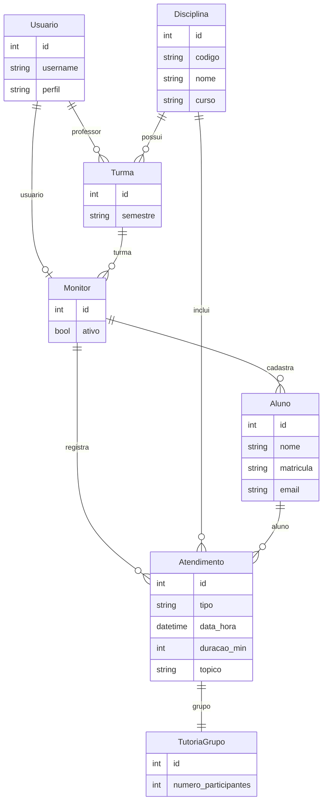

# Sistema de Monitoria IFMG

Sistema de controle de monitoria para o IFMG Betim — gerencia sessões de tutoria entre monitores (alunos tutores) e seus orientandos, com acompanhamento por professores e geração de relatórios.

**Stack:** Django 5 · PostgreSQL (prod) / SQLite (dev) · AdminLTE 3 · ReportLab (PDF)

---

## Sumário

- [Rodar localmente (sem Docker)](#rodar-localmente-sem-docker)
- [Rodar com Docker](#rodar-com-docker-recomendado-para-produção)
- [Configuração inicial do sistema](#configuração-inicial-do-sistema)
- [URLs e fluxo de uso](#urls-e-fluxo-de-uso)
- [Testes](#testes)
- [Deploy em produção](#deploy-em-produção)
- [Diagrama do banco](#diagrama-do-banco)

---

## Rodar localmente (sem Docker)

Esta é a forma mais rápida para desenvolvimento. O banco padrão é **SQLite** — nenhuma instalação extra de banco é necessária.

### Pré-requisitos

- Python 3.11 ou 3.12 instalado (`python3 --version`)
- `pip` e `venv` disponíveis (já inclusos no Python padrão)

### Passo 1 — Clonar o repositório

```bash
git clone <url-do-repositorio>
cd sistema-monitoria-ifmg
```

### Passo 2 — Criar e ativar o ambiente virtual

```bash
python3 -m venv .venv
source .venv/bin/activate   # Linux / macOS
# .venv\Scripts\activate    # Windows (PowerShell)
```

O prompt do terminal deve exibir `(.venv)` ao ativar.

### Passo 3 — Instalar dependências

```bash
pip install -r requirements.txt
```

Pacotes instalados: Django, psycopg2-binary, python-decouple, reportlab, coverage, gunicorn, whitenoise.

### Passo 4 — Configurar variáveis de ambiente

Copie o arquivo de exemplo e edite os valores mínimos para desenvolvimento local:

```bash
cp .env.example .env
```

Edite o `.env` com as configurações de desenvolvimento:

```env
# Obrigatório — gere uma chave com: python -c "import secrets; print(secrets.token_urlsafe(50))"
SECRET_KEY=cole-aqui-sua-chave-gerada

# Para desenvolvimento local com SQLite, as variáveis DB_* abaixo são ignoradas
# (o settings.py padrão usa SQLite automaticamente)
DEBUG=True
ALLOWED_HOSTS=localhost,127.0.0.1

TIME_ZONE=America/Sao_Paulo

# Deixe as variáveis do banco com qualquer valor para evitar erros de leitura
DB_NAME=monitoria
DB_USER=monitoria
DB_PASSWORD=qualquer
DB_HOST=localhost
DB_PORT=5432
```

> **SQLite vs PostgreSQL em dev:** o arquivo `monitoria_ifmg/settings.py` usa SQLite por padrão. Para usar PostgreSQL localmente, veja a seção [Usando PostgreSQL local](#usando-postgresql-local-opcional).

### Passo 5 — Aplicar migrations

```bash
python manage.py migrate
```

Isso cria o arquivo `db.sqlite3` com todas as tabelas do sistema.

### Passo 6 — Criar o superusuário

```bash
python manage.py createsuperuser
```

Informe username, e-mail (opcional) e senha. Depois de criar, você precisará definir o **perfil** como `admin` — veja [Configuração inicial do sistema](#configuração-inicial-do-sistema).

### Passo 7 — Iniciar o servidor

```bash
python manage.py runserver
```

Acesse: **http://127.0.0.1:8000/**

---

### Usando PostgreSQL local (opcional)

Se preferir usar PostgreSQL no desenvolvimento (mais próximo da produção):

1. Instale o PostgreSQL e crie o banco:

```bash
psql -U postgres -c "CREATE USER monitoria WITH PASSWORD 'senha123';"
psql -U postgres -c "CREATE DATABASE monitoria OWNER monitoria;"
```

2. Ajuste o `.env`:

```env
DB_NAME=monitoria
DB_USER=monitoria
DB_PASSWORD=senha123
DB_HOST=localhost
DB_PORT=5432
```

3. No `monitoria_ifmg/settings.py`, troque a configuração `DATABASES` de SQLite para:

```python
DATABASES = {
    'default': {
        'ENGINE': 'django.db.backends.postgresql',
        'NAME': config('DB_NAME'),
        'USER': config('DB_USER'),
        'PASSWORD': config('DB_PASSWORD'),
        'HOST': config('DB_HOST'),
        'PORT': config('DB_PORT'),
    }
}
```

4. Rode `python manage.py migrate` normalmente.

---

## Rodar com Docker (recomendado para produção)

### Pré-requisitos

- [Docker](https://docs.docker.com/get-docker/) 24+
- [Docker Compose](https://docs.docker.com/compose/install/) v2 (incluso no Docker Desktop)

### Passo 1 — Configurar o `.env`

```bash
cp .env.example .env
```

Edite o `.env` com as variáveis para o ambiente Docker:

```env
SECRET_KEY=sua-chave-secreta-longa-e-aleatoria
DEBUG=False
ALLOWED_HOSTS=localhost,127.0.0.1
CSRF_TRUSTED_ORIGINS=http://localhost:8004

TIME_ZONE=America/Sao_Paulo

# Django connection — DB_HOST deve ser o nome do serviço no Compose
DB_NAME=monitoria
DB_USER=monitoria
DB_PASSWORD=sua-senha-segura
DB_HOST=monitoria-db
DB_PORT=5432

# Container do PostgreSQL
POSTGRES_DB=monitoria
POSTGRES_USER=monitoria
POSTGRES_PASSWORD=sua-senha-segura
```

> `DB_HOST=monitoria-db` (nome do serviço no Compose), **não** `localhost`.

### Passo 2 — Subir os containers

```bash
docker compose -f docker-compose.prod.yml up -d --build
```

O Compose irá:
1. Construir a imagem Django a partir do `Dockerfile`
2. Subir o PostgreSQL 16 com healthcheck
3. Executar `migrate` e `collectstatic` automaticamente
4. Iniciar o Gunicorn na porta **8004** do host

Acompanhe os logs:

```bash
docker compose -f docker-compose.prod.yml logs -f
```

### Passo 3 — Criar o superusuário

```bash
docker compose -f docker-compose.prod.yml exec monitoria-web \
  python manage.py createsuperuser \
  --settings=monitoria_ifmg.production_settings
```

### Acessar

| Endereço | Descrição |
|----------|-----------|
| `http://localhost:8004/` | Aplicação principal |
| `http://localhost:8004/admin/` | Django Admin |
| `http://localhost:8004/accounts/login/` | Tela de login |

### Comandos Docker úteis

```bash
# Parar (preserva o banco)
docker compose -f docker-compose.prod.yml down

# Parar e apagar o banco (volumes)
docker compose -f docker-compose.prod.yml down -v

# Reconstruir só a aplicação
docker compose -f docker-compose.prod.yml up -d --build monitoria-web

# Migrations manuais
docker compose -f docker-compose.prod.yml exec monitoria-web \
  python manage.py migrate --settings=monitoria_ifmg.production_settings

# Shell Django
docker compose -f docker-compose.prod.yml exec monitoria-web \
  python manage.py shell --settings=monitoria_ifmg.production_settings
```

---

## Configuração inicial do sistema

Após criar o superusuário (local ou Docker), é necessário definir o perfil dele:

1. Acesse `/admin/` com as credenciais do superusuário
2. Em **Accounts > Usuarios**, clique no usuário criado
3. No campo **Perfil**, selecione `admin`
4. Salve

Agora você pode:
- Criar **Disciplinas** e **Turmas** (menu Admin no sistema)
- Criar usuários com perfil `professor` e associá-los a turmas
- Criar usuários com perfil `monitor` e associá-los a turmas

### Fluxo de cadastro sugerido

```
1. Admin cria Disciplinas
2. Admin cria Turmas (vinculando disciplina + professor)
3. Professor cria/acessa seus monitores
4. Monitor registra alunos e atendimentos
```

---

## URLs e fluxo de uso

| URL | Descrição |
|-----|-----------|
| `/accounts/login/` | Login |
| `/admin/` | Django Admin |
| `/` | Home (redireciona conforme perfil) |

### Monitor

1. Logar no sistema
2. (Opcional) Cadastrar alunos frequentes em **Meus alunos**
3. Registrar atendimentos:
   - **Registrar individual** — selecione aluno existente ou crie inline
   - **Registrar grupo** — informe o número de participantes (≥ 2)
4. Acompanhar em **Meus atendimentos** — filtrar por tipo e período, editar e excluir

### Professor

1. Logar no sistema
2. **Dashboard** — cards do mês, gráfico semanal e alerta de alunos com muitos atendimentos
3. **Histórico** — buscar aluno por nome ou matrícula e ver cronologia
4. **Dificuldades** — ranking top 10 com filtros por disciplina e período
5. **Relatórios** — filtros avançados e exportação PDF (máx. 200 linhas por exportação)

---

## Testes

```bash
# Ativar o ambiente virtual antes
source .venv/bin/activate

# Todos os testes
python manage.py test

# Testes de um app específico
python manage.py test atendimentos

# Um teste específico
python manage.py test atendimentos.tests.AtendimentosSprint2Tests.test_criar_atendimento_individual_com_aluno_existente

# Com cobertura (espelha o CI)
python -m coverage run --source=atendimentos -m django test -v 2
python -m coverage report --fail-under=70 -m
```

O CI (GitHub Actions) roda a suíte completa e exige **≥ 70% de cobertura** no app `atendimentos`.

---

## Deploy em produção

1. Configure as variáveis de ambiente no servidor:

```env
SECRET_KEY=chave-longa-aleatoria
DEBUG=False
ALLOWED_HOSTS=seu-dominio.com,www.seu-dominio.com
CSRF_TRUSTED_ORIGINS=https://seu-dominio.com
DB_NAME=...
DB_USER=...
DB_PASSWORD=...
DB_HOST=...
DB_PORT=5432
```

2. Colete os arquivos estáticos:

```bash
DJANGO_SETTINGS_MODULE=monitoria_ifmg.production_settings python manage.py collectstatic --noinput
```

3. Aplique migrations:

```bash
DJANGO_SETTINGS_MODULE=monitoria_ifmg.production_settings python manage.py migrate
```

4. Inicie com Gunicorn:

```bash
DJANGO_SETTINGS_MODULE=monitoria_ifmg.production_settings gunicorn monitoria_ifmg.wsgi
```

---

## Diagrama do banco


